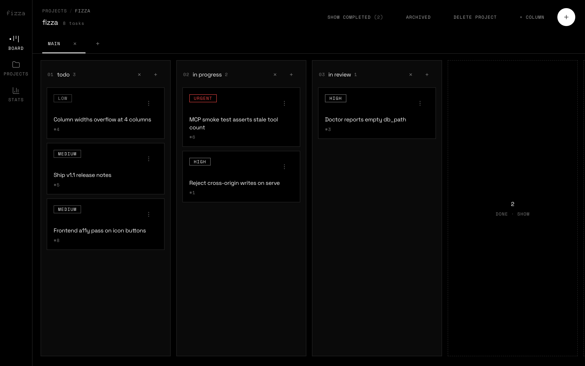
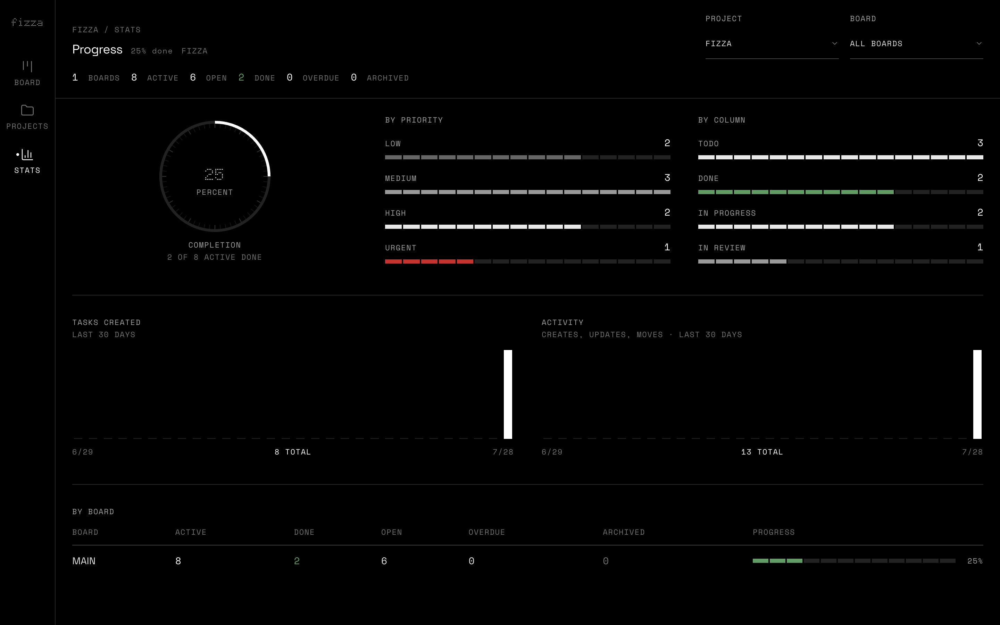

<h1 align="center">fizza</h1>

<p align="center">
  <strong>A kanban board that your agents can use too.</strong>
</p>

<p align="center">
  One binary. One SQLite file. Three ways in.<br />
  No account, no cloud, no daemon.
</p>

<p align="center">
  <a href="#install">Install</a>
  ·
  <a href="#sixty-seconds">Quick start</a>
  ·
  <a href="#cli">CLI</a>
  ·
  <a href="#mcp">MCP</a>
  ·
  <a href="https://github.com/sthbryan/fizza/releases/latest">Releases</a>
</p>

---

You track work in one place. Your coding agent tracks it in another — a scratch file, a todo list it forgets, a comment thread nobody reads. By Friday the two have nothing to do with each other.

**fizza is one board that both of you write to.** You drag a card in the browser; the agent sees it moved. The agent closes a task over MCP; it is gone from your column before you switch windows. Same database, same rules, no sync step.

**It is a single static binary.** CGO-free, no runtime dependencies, nothing listening unless you ask. Your data is a SQLite file in `~/.config/fizza/` that you can copy, diff, or delete.

---

## Screenshots

|  |  |
| :--: | :--: |
| **Board** — drag between columns, live over SSE | **Stats** — completion, priority mix, 30-day activity |

---

## Three surfaces, one database

**Web UI** — `fizza serve`  
Drag-and-drop columns, projects, archives, progress stats. Local HTTP, updates live over SSE, assets embedded in the binary so it runs from any directory.

**CLI** — `fizza task add`, `fizza task move`  
Scriptable and quiet. Structured output by default, tables when you want to read them yourself. Exit codes tell "not found" apart from "invalid" and "conflict", so shell scripts can branch on them.

**MCP** — `fizza mcp`  
An stdio server for Claude Code, Cursor, and anything else that speaks MCP. 18 tools over the same model, with lean payloads: listings skip archived work and compress finished tasks down to counts, so a board snapshot does not eat the context window.

---

## Install

**macOS / Linux**

```bash
curl -fsSL https://raw.githubusercontent.com/sthbryan/fizza/main/scripts/install.sh | sh
```

Picks the asset for your OS and arch, verifies its SHA256, installs to `/usr/local/bin` (or `~/.local/bin` when that is not writable), and prints the version.

| | |
|---|---|
| **Install script** | The one-liner above — macOS and Linux, amd64 and arm64 |
| **Download** | [Releases](https://github.com/sthbryan/fizza/releases/latest) — archives plus `.deb`, `.rpm`, and `.apk` |
| **From source** | `make install` — needs Go 1.26+ and Bun |

Building from source installs to `$(go env GOPATH)/bin`. Point it somewhere else with `BINDIR`:

```bash
make install BINDIR=/usr/local/bin
```

---

## Sixty seconds

```bash
fizza project new myapp
fizza config set project myapp

fizza task add "Ship the first cut"
fizza task add "Write docs" --priority high
fizza task list

fizza task move 1 done
fizza serve                    # http://127.0.0.1:6500
```

Reading along yourself? Switch to tables once and forget about it:

```bash
fizza config set mode human
```

---

## How it fits together

```
Project
  └── Board (e.g. main)
        └── Columns (todo → in_progress → in_review → done)
              └── Tasks (priority, due date, tags, subtasks)
```

A task is **open** while it sits in a non-terminal column. Moving it to `done`, `completed`, or `closed` stamps `completed_at`. **Archiving** hides it from the active board without deleting it, and it can come back.

That distinction is what keeps agent payloads small: listings omit archived tasks and trim finished ones to counts, unless you ask for them with `--include-done` or `--archived`.

---

## CLI

| Command | Manages |
|---------|---------|
| `project` | projects — create, list, update, delete |
| `board` | boards, columns, WIP limits |
| `task` | tasks — add, list, move, update, archive, delete |
| `tag` | labels |
| `config` | defaults: project, board, output mode |
| `serve` | the web UI |
| `mcp` | the MCP server over stdio |
| `doctor` | self-checks against the local install |
| `schema` | migrations and integrity |

Everyday flow:

```bash
fizza task list                  # active work; done omitted
fizza task list --include-done   # include completed
fizza task list --archived       # only archived
fizza task move 12 done
fizza task archive 12
fizza task archive-done          # archive every done task on this board
fizza task unarchive 12
```

**Output formats.** `toon` is a compact structured format that costs fewer tokens than JSON; `pretty` is human tables; `json` is JSON. Pick one per command with `--format`, or set a mode once:

| Mode | Default format |
|------|----------------|
| `llm` (default) | `toon` |
| `human` | `pretty` |

**Exit codes.** `0` ok · `1` internal · `2` not found · `3` validation · `4` duplicate · `5` conflict.

---

## Web UI

```bash
fizza serve                      # 127.0.0.1:6500, opens your browser
fizza serve --port 8080 --no-open
```

Routes: `/projects` · `/p/:project/b/:board` · `/p/:project/b/:board/archived` · `/stats`

There is no authentication — this is a local tool, so don't expose it beyond localhost. Requests carrying a non-loopback `Origin`, or a `Host` that is a DNS name other than `localhost`, are refused with `403`: that stops a page in another browser tab from driving your board, and blocks DNS rebinding. Clients that send no `Origin` — `curl`, scripts, the CLI — are unaffected.

The frontend lives in `web/` (Svelte 5, Vite, TanStack Query, Tailwind) and is embedded into the binary at build time.

---

## MCP

```bash
fizza mcp
```

Point your client at that stdio command:

```json
{
  "fizza": {
    "command": "fizza",
    "args": ["mcp"]
  }
}
```

Agents get the same model and the same lifecycle rules as the CLI: lean snapshots by default, archive rather than delete. If a client cannot speak MCP, shell out to `fizza --format json` and parse stdout — every command answers with the same `{ok, data}` or `{ok, error}` envelope.

---

## Configuration

Global config lives at `~/.config/fizza/config.json`, with the database beside it as `default.db`.

| Key | Effect |
|-----|--------|
| `mode` | `llm` (default) or `human` |
| `project` | default project for board and task commands |
| `board` | default board when a project has more than one |

```bash
fizza config show
fizza config set project myapp
fizza config path
```

Per-directory overrides go in a `.fizza` file, found by walking up from the working directory until a `.git` or `$HOME`:

```
PROJECT=myapp
MODE=human
```

---

## Development

Go 1.26+ and Bun.

```bash
make build-full   # web assets + bin/fizza with the UI embedded
make build        # Go only; serves a fallback page if web isn't built
make web          # bun install + vite build into internal/httpapi/static
make test         # go test ./...
make test-race    # go test -race ./...
make vet          # go vet ./...
make fmt          # gofmt -w, then verify nothing is left unformatted
make mcp-test     # drive the MCP server end to end over stdio
make install      # build and copy to $BINDIR (default $(go env GOPATH)/bin)
```

Hot reload against a running `fizza serve`:

```bash
cd web && bun run dev          # :5173, proxies /v1 to :6500
```

Frontend checks: `cd web && bun run verify` runs biome and svelte-check.

---

## Design notes

- **SQLite + WAL** — concurrent readers, one writer, survives a crash mid-move.
- **Fractional positions** — dropping a card between two others touches one row, not the whole column.
- **Event log** — every change is appended locally; the web UI tails it over SSE, which is why two windows stay in step.
- **WIP limits** — optional per-column caps, enforced on move rather than warned about afterwards.
- **Lean by default** — the payload an agent gets is the small one; the full picture is opt-in.

---

<p align="center">
  <sub>MIT License · © 2026 Bryan Villafuerte</sub>
</p>
